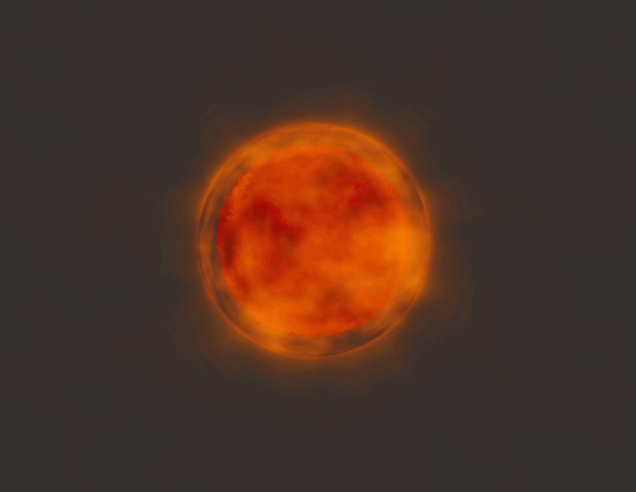

# [Project 1: Noise](https://github.com/CIS-566-Fall-2022/hw01-fireball-base)

## Overview

- Name: Tongwei Dai
- [live demo](https://dw218192.github.io/hw01-fireball/) 
- Note: the shaders are quite heavy and unoptimized, you can turn off the second pass if your computer is struggling to render the scene

### Techniques
- this fireball is rendered using two passes
- the first pass draws a simple icoshpere with vertices and fragment colors modified by a multi-octave noise function
- the second pass draws the outer cloudy layer of the fireball using SDF and raymarching
- the final image is simply a blend between the two passes
- the fireball is animated by using time to offset and scale the noise function
